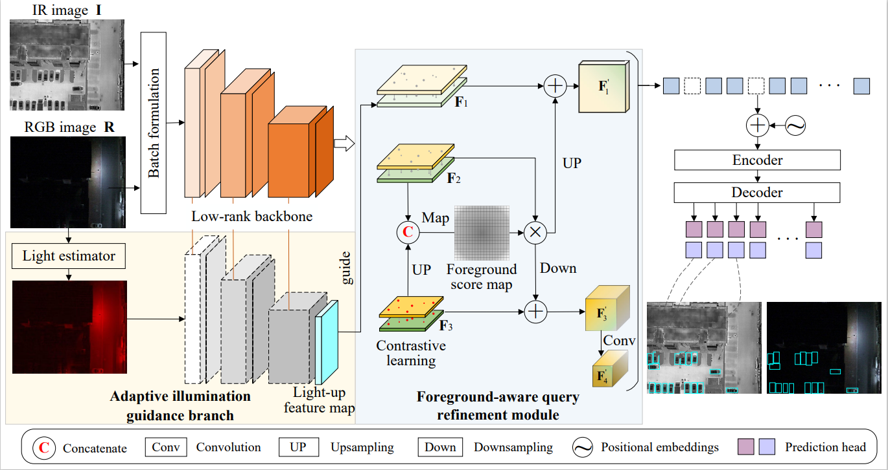

# Efficient Multimodal Remote Sensing Object Detection with Adaptive Illumination Guidance

[](https://opensource.org/licenses/Apache-2.0)


Official implementation of our paper on efficient multimodal object detection for remote sensing images using adaptive illumination guidance and transformer-based architecture.

 

## Key Features
- 🚀 Single backbone network for efficient multimodal (visible + infrared) feature extraction
- ☀️ Adaptive illumination guidance branch for robust feature learning
- 🔍 Foreground-aware query refinement module for discriminative object queries
- ⚖️ Optimal balance between detection accuracy and computational efficiency

## Datasets
Our method has been evaluated on:
- [DroneVehicle Dataset](https://github.com/VisDrone/DroneVehicle)
- [VEDAI Dataset](https://downloads.greyc.fr/vedai/)


## Installation
*(Will be updated when code is released)*
```bash
# Coming soon
git clone https://github.com/cq100/EIMDet.git
```

## Usage
*(Will be updated when code is released)*
```python
# Sample usage will appear here


## Coming Soon
🚧 **Code Under Preparation** 🚧  
We're currently finalizing the codebase and documentation. The complete implementation including:
- Training and evaluation scripts
- Pretrained models
- Detailed configuration files
- Comprehensive documentation

will be released shortly. Please watch this repository or check back later for updates!
